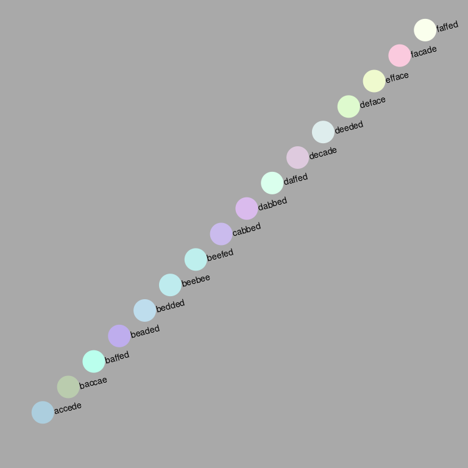

<!-- README.md is generated from README.Rmd. Please edit that file -->

# hexwords

<!-- badges: start -->
<!-- badges: end -->

The goal of hexwords is to find words that are colours.

## Installation

You can install the dev version of hexwords from github with:

``` r
remotes::install_github("mdsumner/hexwords")
```

## Example

This is a basic example which shows you the colour of several english
words, it’s extremely interesting and important.

``` r
library(hexwords)
## basic example code
op <- par(mar = rep(0, 4), bg = "darkgrey")
plot(seq_along(english_hex), col = sprintf("#%s", english_hex), pch = 19, cex = 5, asp = 1, ylim = c(-0.2, length(english_hex) + 0.2), xlim = c(0, length(english_hex)  + 1), xlab = "", ylab = "", axes = F)
text(seq_along(english_hex), lab = english_hex, srt = 15, cex = 0.9, pos = 4, offset = 1)
```



``` r
par(op)
```

## Code of Conduct

Please note that the hexwords project is released with a [Contributor
Code of
Conduct](https://contributor-covenant.org/version/2/0/CODE_OF_CONDUCT.html).
By contributing to this project, you agree to abide by its terms.
